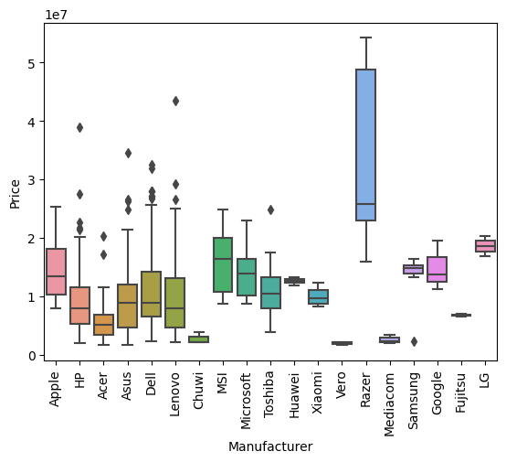
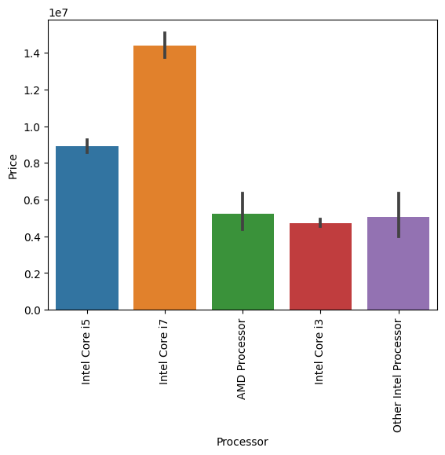

# Laptop Price Prediction

El objetivo de este proyecto es la predicción de precios de ordenadores a partir de un csv de Kaggle.
Se han seguido una serie de pasos para el proyecto:

1. Obtención de los datos
2. Definir el problema
3. EDA
4. Transformación de los datos
5. Modelo de entrenamiento

## Analisis Exploratorio de los datos

1. Tipo de dato de cada columna
2. Valores nulos
3. Outliers
4. distribución en columnas categoricas
5. Gráficos de correlación
6. Ingenieria de caracteristicas 

## Preparación de los datos 

1. Limpieza de datos y agrupación
2. Creación de nuevas columnas con transformaciones
3. Getdummies para variables categóricas

## Estudio de la varibale objetivo

Gráficos de correlación

  
Manufacturer vs Price

   

  

  
Category vs Price

   

  

  
Processor vs Price

   

  

  
RAM vs Price

   

  

  
Screen Size vs Price

   

  

  
Storage vs Price

   

  

 

  
Operating System vs Price

   

  

## Conclusión y resultados 

Una vez realizado el estudio de las variables numéricas y categóricas, se divide dataset en una parte de train (80% de los datos) y otra de test (20%). Establecemos una semilla para que la división cada vez que se ejecuta el código sea la misma. 

El modelo que ofrecía mejores resultados es el Random Forest.
